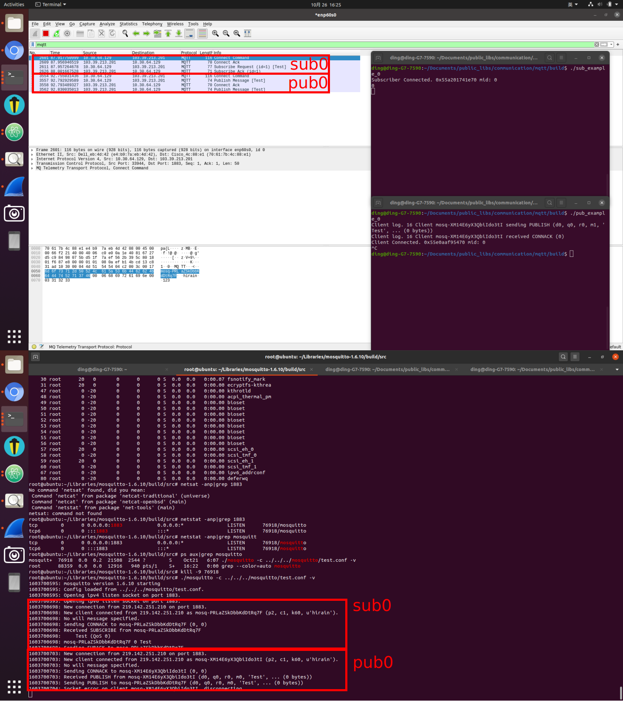
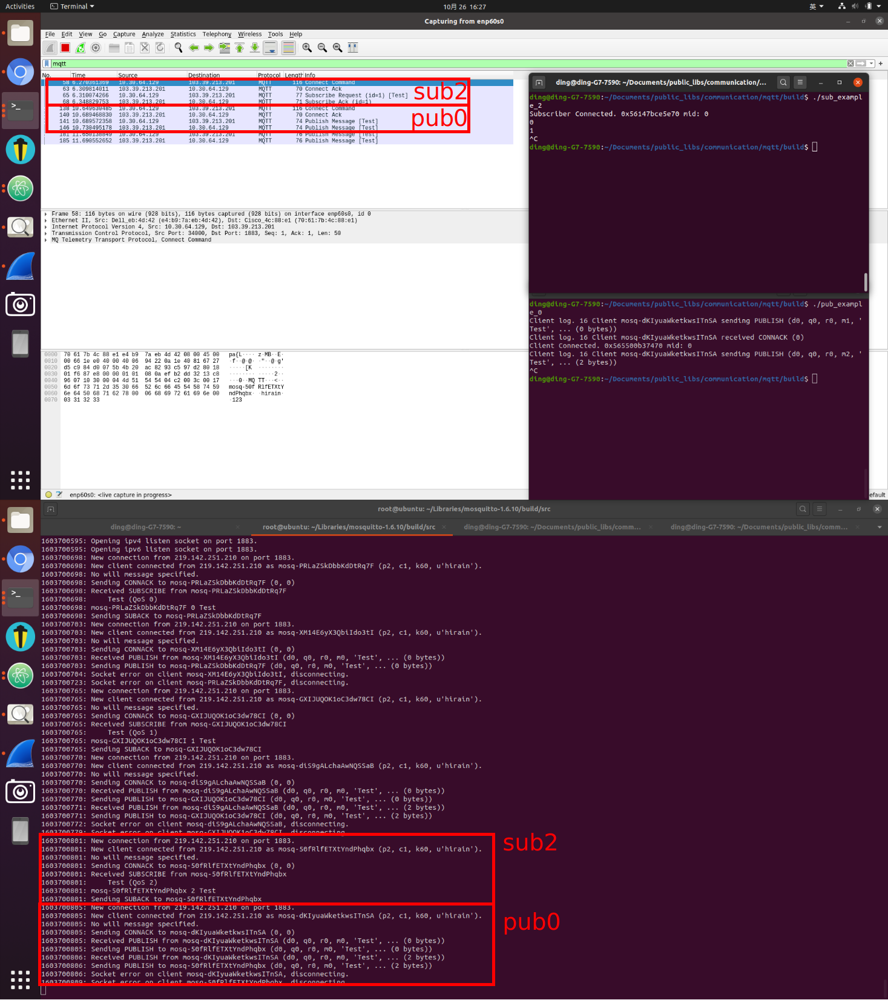
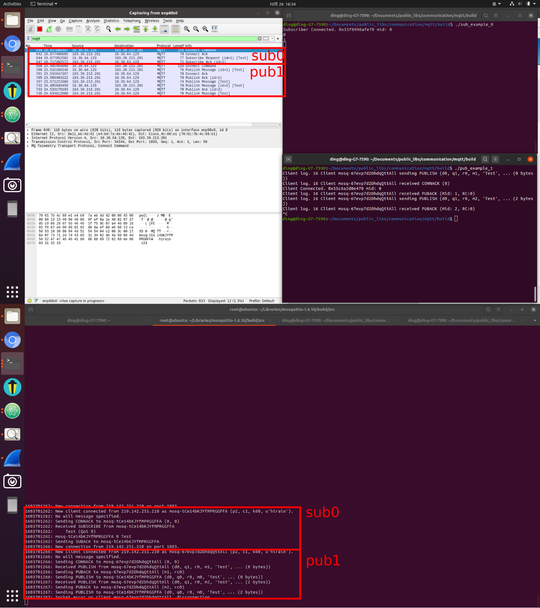
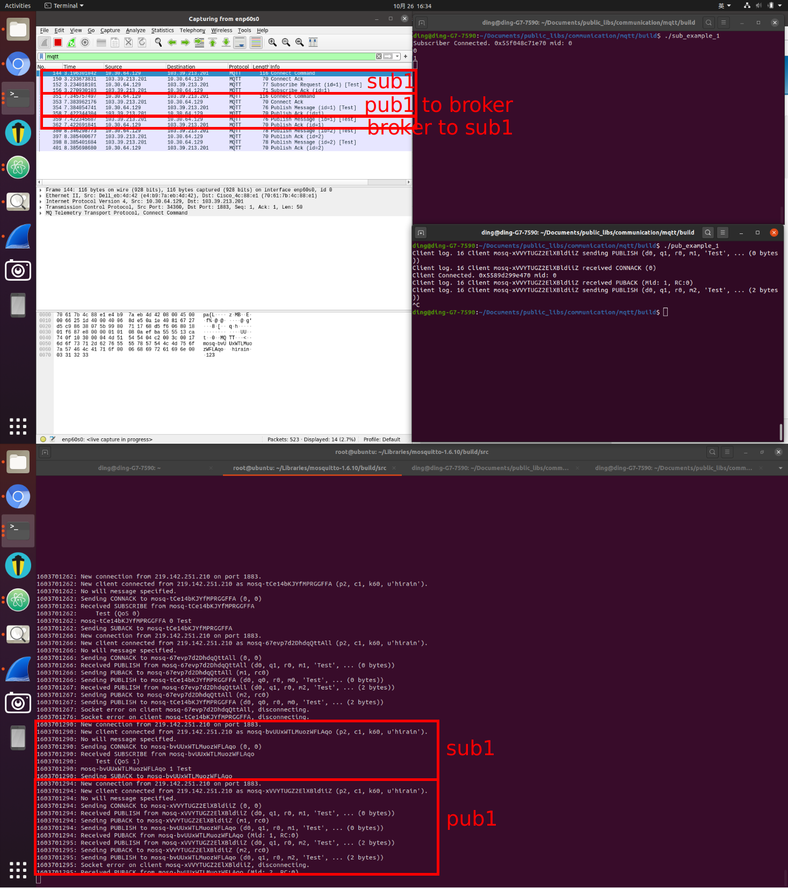
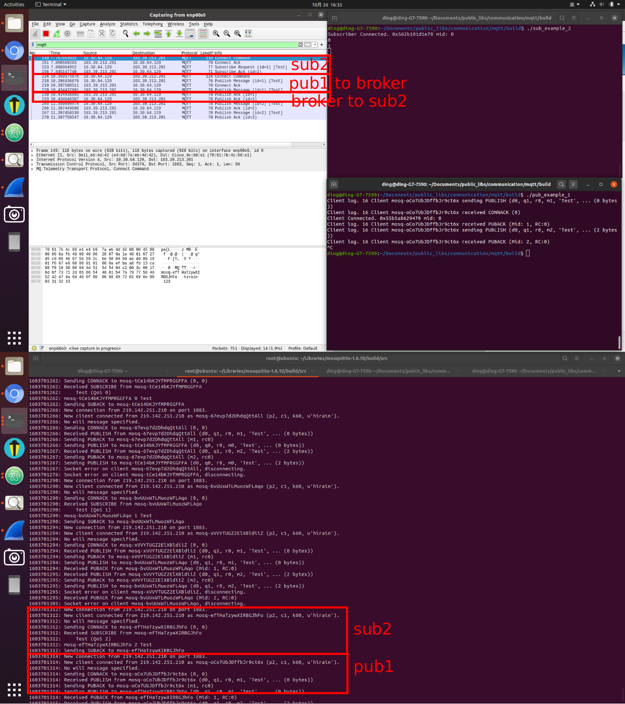
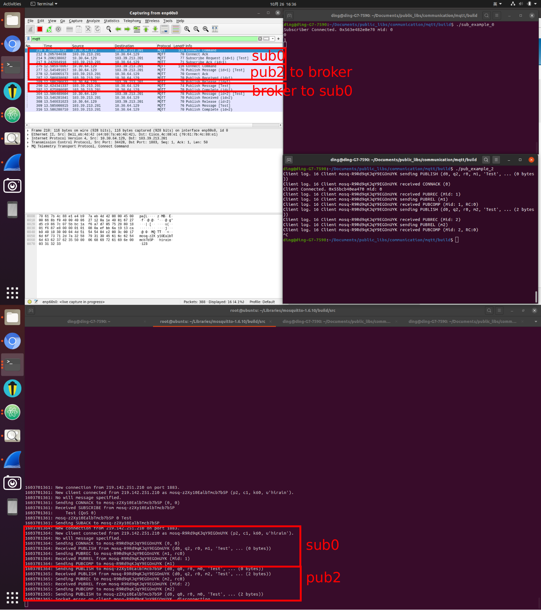
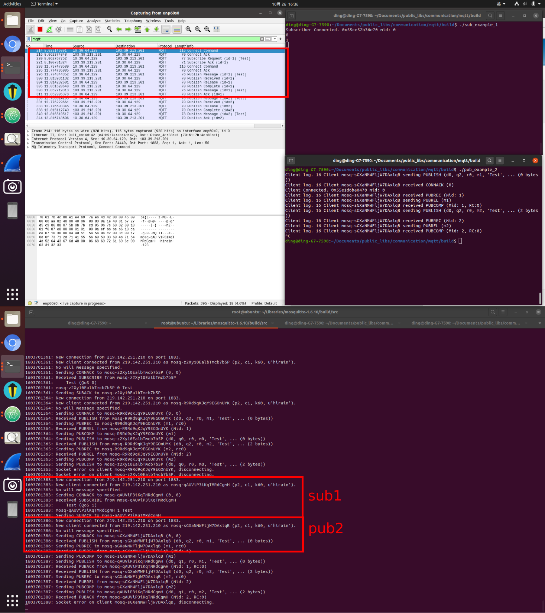
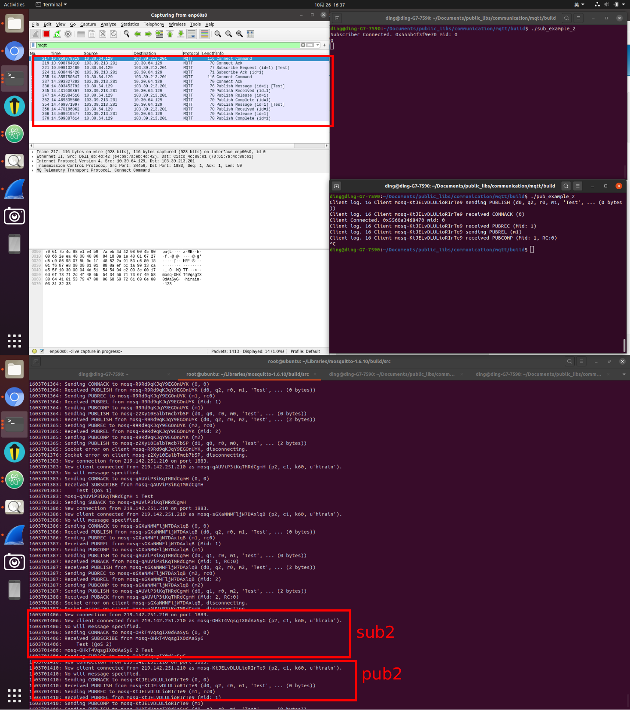

# MQTT

## QOS Study

### `What is qos`
Qos means `"quality of service"`. It defined whether is message is stable. Different with DDS (qos 7 levels), mqtt has `3 levels` which are `0, 1, 2`.
* qos0: at least 0 time. In brief, just send, do not care whether received.
* qos1: at least once.
* qos2: confirm exactly once.

### `Pre-preparation`
It is better to use mqtt first to better understand what it could do for us.

* 1. Install an mqtt broker on your local pc or on your cloud server. [Emqx](https://github.com/emqx/emqx) or [mosquitto](https://github.com/eclipse/mosquitto) are both good choice.

* 2. And then you could install `mosquitto-clients` (`sudo apt install mosquitto-clients` on ubuntu) to test the communication between `subscriber` and `publisher`. If you want to develop some demos by yourself there is a [project](https://github.com/FengD/public_libs/tree/master/communication/mqtt) that you could refer.

### `Understand qos by wireshark`
* The qos could be defined both on `sub` and `pub` side. So the different combinations are as below.
```
P(QOS0)、S(QOS0)
P(QOS0)、S(QOS1)
P(QOS0)、S(QOS2)
P(QOS1)、S(QOS0)
P(QOS1)、S(QOS1)
P(QOS1)、S(QOS2)
P(QOS2)、S(QOS0)
P(QOS2)、S(QOS1)
P(QOS2)、S(QOS2)
```
But as we test, `if( S(QOS) > P(QOS) ) { S(QOS) = P(QOS) ;}`. So actually, there are only 6 combinations.
```
P(QOS0)、S(QOS0)
P(QOS1)、S(QOS0)
P(QOS1)、S(QOS1)
P(QOS2)、S(QOS0)
P(QOS2)、S(QOS1)
P(QOS2)、S(QOS2)
```

* Lets use wireshark to check what happens.

||Subscriber| Publisher|Broker|
|----|----|----|----|
|ip|10.30.64.129|10.30.64.129|103.39.213.201|


#### P(QOS0)、S(QOS2) == P(QOS0)、S(QOS1) == P(QOS0)、S(QOS0)
* p0s0

* p0s1

* p0s2


#### P(QOS1)、S(QOS2) == P(QOS1)、P(QOS1)
* p1s0

* p1s1

* p1s2


#### P(QOS2)
* p2s0

* p2s1

* p2s2


## Reference
[link1](https://blog.csdn.net/qq1623803207/article/details/89518318)
